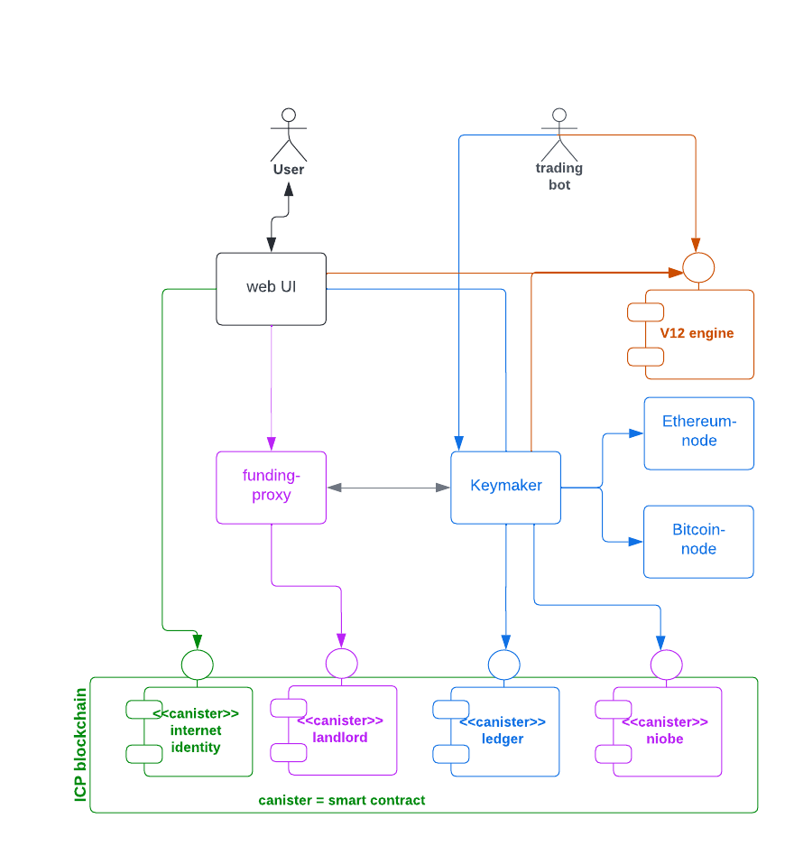

# Helix markets -- system overview

Helix markets is a hybrid exchange with components deployed on the [internet computer blockchain](https://internetcomputer.org/) (ICP) as well as off the chain. It consists of the following building blocks:

- [`landlord`](https://matrix.fandom.com/wiki/The_Landlord) smart contract [deployed](https://a4gq6-oaaaa-aaaab-qaa4q-cai.raw.ic0.app/?id=ox6gn-2aaaa-aaaag-qb45a-cai) on the internet computer
- [`niobe`](https://matrix.fandom.com/wiki/Niobe) smart contract [deployed](https://a4gq6-oaaaa-aaaab-qaa4q-cai.raw.ic0.app/?id=hbslw-tiaaa-aaaag-qb5oq-cai) on the internet computer
- helix web UI: used by humans for authentication, funding and trading
- funding proxy: exposes the user management services performed by the "landlord" smart contract to clients; shields the rest of the system from the [complexity of interacting with an ICP smart contract](https://internetcomputer.org/docs/current/references/ic-interface-spec/#http-call-overview).
- [keymaker](https://matrix.fandom.com/wiki/The_Keymaker): a service that implements funding use cases i.e. deposits, withdrawals as well as transfers between the funding and the trading wallets.
- V12: high-speed, low latency trading engine
- [`seraph`](https://matrix.fandom.com/wiki/Seraph): a service that registers new users and authenticates registered users towards the off-chain part of the system

Please note:
- all the components above -- except for `V12` -- have been written in the `rust` programming language
- all the components above -- except for the `landlord` and the `niobe` smart contracts -- are running off the chain
- smart contracts are called [canisters](https://internetcomputer.org/docs/current/concepts/canisters-code) in ICP jargon

# code base size in LOC
|component          | LOC   |
|:-----------------:|------:|
|funding-proxy      | 2939  |
|keymaker           | 5066  |
|seraph             | 1333  |
|landlord           | 230   |
|niobe              | 228   |

# smart contracts

## landlord
Responsible for user registration, the management of funding wallet addresses and the signing of withdrawal transactions (using [threshold ECDSA chain-key signatures](https://internetcomputer.org/docs/current/developer-docs/integrations/t-ecdsa)).

Each registered user
- has his own funding wallet with a set of of segregated funding addresses (one per chain supported by the exchange)
- can observe the respective funding balances on-chain
- can request withdrawals of funding balances

Please note: `landlord` keeps its own persistent state with the following data: a map of
- [principal](https://support.dfinity.org/hc/en-us/articles/7365913875988-What-is-a-principal-) id -> helix user id (`huid`)
- `huid` -> funding wallet address (one per chain supported)

This persistent state must be preserved across [smart contract upgrades](https://internetcomputer.org/docs/current/developer-docs/security/rust-canister-development-security-best-practices#consider-using-stable-memory-version-it-test-it).

## niobe
In order to trade a user needs to transfer funds from the funding to the trading wallet managed by `niobe`. `niobe` keeps
- trading wallet funds in [omnibus addresses](https://www.investopedia.com/terms/o/omnibusaccount.asp) (one per chain)
- a ledger that captures the per-user trading wallet balances i.e. how much of the omnibus address balance is owned by each user

Similarly to `landlord` `niobe` also keeps its own persistent state that must be preserved across upgrades.

# funding proxy

The funding proxy is awrapper around the `landlord` smart contract and provides its services via a [rest api](https://app.swaggerhub.com/apis/MUHAREM_2/funding-proxy_api/).
It facilitates the registration of new users (which includes the allocation of segregated funding wallet addresses), the retrieval of user data and the management of user email addresses.

Please note that the `funding-proxy` service has a copy of the user data in its encrypted database. The canister's copy is regarded as the master record however.

[API docs](https://app.swaggerhub.com/apis/MUHAREM_2/funding-proxy_api/)

# keymaker

Registered users hold 2 wallets with the exchange, a
- funding wallet: deposits arrive here and funds in this wallet can be withdrawn at any time
- trading wallet: users need to transfer the funds they want to trade to this wallet; funds in this wallet cannot be withdrawn

The `keymaker` service is responsible for
- monitoring the blockchains supported for arriving deposits
- withdrawals
- transfer of funds between the funding and trading wallet

[API docs](https://app.swaggerhub.com/apis/MUHAREM_2/keymaker-fund_api/)

# seraph

`seraph` is used to both register new users as well as to authenticate registered users. It relies on the [internet identity](https://internetcomputer.org/internet-identity) system to do so.

When a registered user logs in for the first time, `seraph` will generate the following credentials
- a public/secret key pair for REST API authentication
- an authentication token for the trading engine websocket

The user may reset these credentials using the REST API below.

[API docs](https://app.swaggerhub.com/apis/Helix-Markets/seraph/)

# V12 trading engine

The V12 trading engine was built from scratch to facilitate low-latency and high-volume order management for retail as well as institutional users and trading bots.

The trading engine is orders of magnitude faster than `niobe` -- the balances kept by it are thus authoritative and the true representation of users' trading balances.

It offers websockets based APIs for
- [market data distribution](https://helix-ex.github.io/apidocs/docs/market-data/#market-data-api)
- [order management](https://helix-ex.github.io/apidocs/docs/order-management/#order-management-api)

# general principles / considerations

* high-volume APIs use websockets whereas low-volume APIs use REST
* all APIs (except for the market data API) are authenticated
* backend services use service accounts (key/secret) to authenticate to each other (example: `keymaker` to `funding-proxy`)
* service account credentials (key/secret) are rotated frequently
* key material (or any other sensitive data) is encrypted at rest
* we don't want to traverse the public internet in order to obtain key material or service account credentials
* REST APIs calls protect against replay attacks by using a timestamp (5 seconds in the past or shorter)
* we apply [defense in depth](https://en.wikipedia.org/wiki/Defense_in_depth_(computing)) to protect our systems
* every backend service has its own database encryption key that is rotated every K hours
* all APIs must be rate limited to prevent abuse
* amounts shall be passed as strings across APIs and be handled as decimal types in code (e.g. using a [package like this](https://docs.rs/bigdecimal/latest/bigdecimal/)) in order to avoid rounding issues
