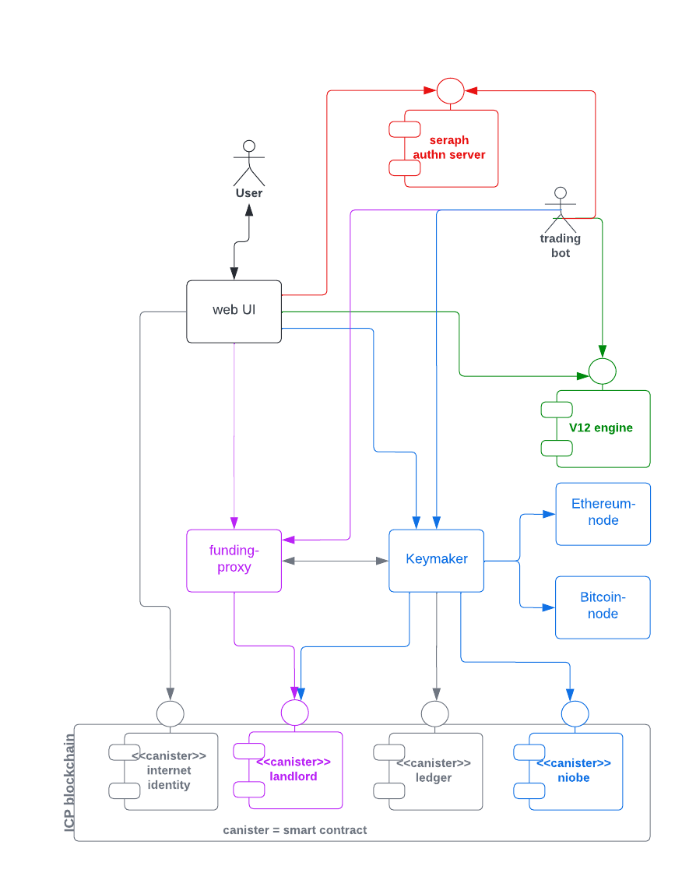

# Helix markets -- system overview

Helix markets is a hybrid exchange with components deployed on the [internet computer blockchain](https://internetcomputer.org/) (ICP) as well as off the chain. It consists of the following building blocks:

- [`landlord`](https://matrix.fandom.com/wiki/The_Landlord) smart contract [deployed](https://a4gq6-oaaaa-aaaab-qaa4q-cai.raw.ic0.app/?id=ox6gn-2aaaa-aaaag-qb45a-cai) on the internet computer
- [`niobe`](https://matrix.fandom.com/wiki/Niobe) smart contract [deployed](https://a4gq6-oaaaa-aaaab-qaa4q-cai.raw.ic0.app/?id=hbslw-tiaaa-aaaag-qb5oq-cai) on the internet computer
- helix web UI: used by humans for authentication, funding and trading
- funding proxy: exposes the user management services performed by the "landlord" smart contract to clients; shields the rest of the system from the [complexity of interacting with an ICP smart contract](https://internetcomputer.org/docs/current/references/ic-interface-spec/#http-call-overview).
- [keymaker](https://matrix.fandom.com/wiki/The_Keymaker): a service that implements funding use cases i.e. deposits, withdrawals as well as transfers between the funding and the trading wallets.
- V12: high-speed, low latency trading engine
- [`seraph`](https://matrix.fandom.com/wiki/Seraph): a service that registers new users and authenticates registered users towards the off-chain part of the system

Please note that all the components above -- except for `V12` -- have been written in the `rust` programming language.
Please note that all the components above -- except for the `landlord` and the `niobe` smart contracts -- are running off the chain.

# smart contracts

## landlord
Responsible for user registration, the management of funding wallet addresses and the signing of withdrawal transactions (using [threshold ECDSA chain-key signatures](https://internetcomputer.org/docs/current/developer-docs/integrations/t-ecdsa)).

Each registered user
- has his own funding wallet with a set of of segregated funding addresses (one per chain supported by the exchange)
- can observe the respective funding balances on-chain
- can request withdrawals of funding balances

Please note: `landlord` keeps its own persistent state with the following data: a map of
- [principal](https://support.dfinity.org/hc/en-us/articles/7365913875988-What-is-a-principal-) id -> helix user id (`huid`)
- `huid` -> funding wallet address (one per chain supported)

This persistent state must be preserved across [smart contract upgrades](https://internetcomputer.org/docs/current/developer-docs/security/rust-canister-development-security-best-practices#consider-using-stable-memory-version-it-test-it).

## niobe
In order to trade a user needs to transfer funds from the funding to the trading wallet managed by `niobe`. `niobe` keeps
- trading wallet funds in [omnibus addresses](https://www.investopedia.com/terms/o/omnibusaccount.asp) (one per chain)
- a ledger that captures the per-user trading wallet balances i.e. how much of the omnibus address balance is owned by each user

# funding proxy

Users will register with a `PrincipalId` they control. The `landlord` canister will keep user funds in an [account](https://internetcomputer.org/docs/current/references/ledger#_accounts) that is derived from the canister's `PrincipalId` and a user identifier (`uid`). The latter is allocated to the user (to his `PrincipalId` to be more precise) upon registration.

The funding proxy is in charge of
- user registration
- allocating segregated deposit addresses for each user and blockchain supported

Please note that:

1. the `funding-proxy` service will have a copy of the user data in its encrypted database. The canister's copy will be regarded as the master record however.
1. any funds owned by a user will be kept in the corresponding `landlord` canister account or user-specific deposit addresses for non-ICP assets
1. all accounts that hold user funds are controlled by the canister's `PrincipalId`

[API docs](https://app.swaggerhub.com/apis/MUHAREM_2/funding-proxy_api/1.0.14)

# keymaker

Registered users hold 2 wallets with the exchange, a
- funding wallet: deposits arrive here and funds in this wallet can be withdrawn at any time
- trading wallet: users need to transfer the funds they want to trade to this wallet; funds in this wallet cannot be withdrawn

The `keymaker` service is responsible for
- monitoring the blockchains supported for arriving deposits
- withdrawals
- transfer of funds between the funding and trading wallet

[API docs](https://app.swaggerhub.com/apis/MUHAREM_2/keymaker-fund_api/1.0.4)

# V12 trading engine

The V12 trading engine was built from scratch to facilitate low-latency and high-volume order management for retail as well as institutional users and trading bots.
It offers websockets based APIs for
- [market data distribution](https://helix-ex.github.io/apidocs/docs/market-data/#market-data-api)
- [order management](https://helix-ex.github.io/apidocs/docs/order-management/#order-management-api)

# general principles / considerations

* high-volume APIs use websockets whereas low-volume APIs use https+REST
* all APIs (except for the market data API) will be authenticated
* backend services will use service accounts (key/secret) to authenticate to each other (example: `keymaker` to `funding-proxy`)
* service account credentials (key/secret) will be rotated frequently (every N hours) (N=4h?)
* key material (or any other sensitive data) must be
  * encrypted at rest
  * zeroized immediately after use (to limit exposure / damage from memory dumps)
* we don't want to traverse the public internet in order to obtain key material or service account credentials
* REST APIs calls need to protect against replay attacks by using a timestamp (5 seconds in the past or shorter)
* we apply [defense in depth](https://en.wikipedia.org/wiki/Defense_in_depth_(computing)) to protect our systems
* every backend service will have its own database encryption key that is rotated every K hours (K=24h?)
* we want to use proven / open source tools if they exist and minimize building/maintaining such tools ourselves
* all backend services will be coded in rust
* all APIs must be rate limited to prevent abuse
* amounts shall be passed as strings across APIs and be handled as decimal types in code (e.g. using a [package like this](https://pkg.go.dev/github.com/shopspring/decimal)) in order to avoid rounding issues
